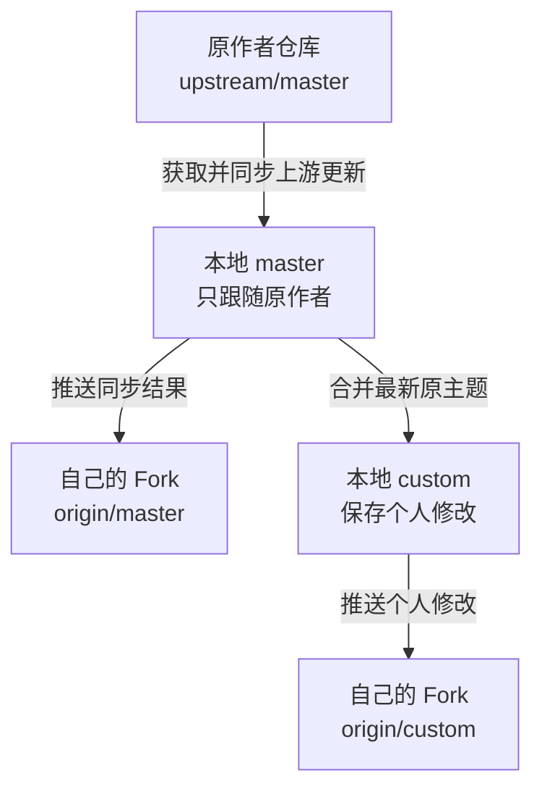
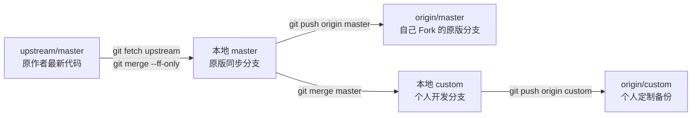
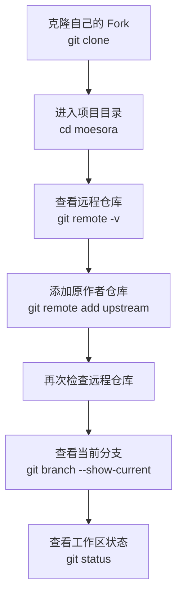
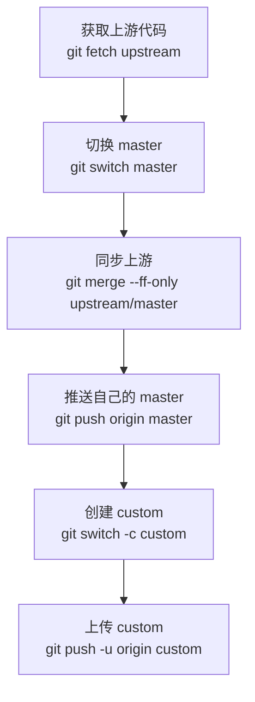
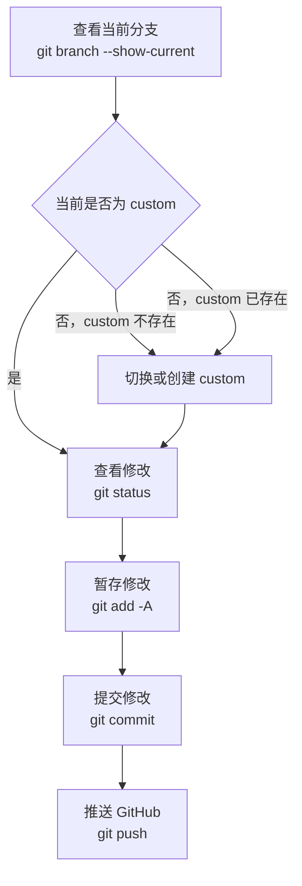
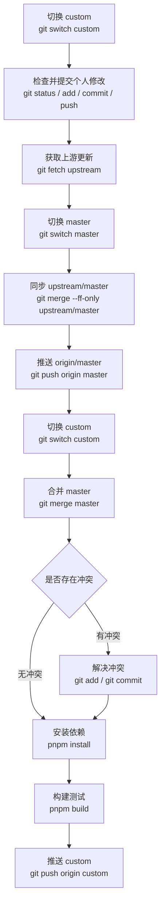
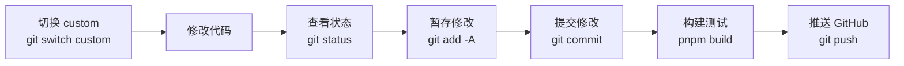
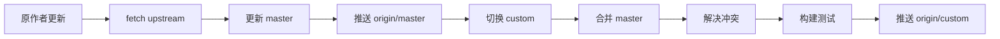
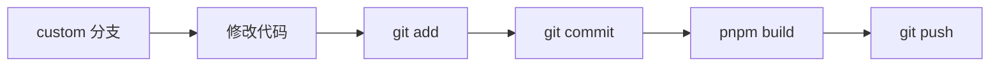

# Moesora主题 Fork 本地开发与上游同步指南

本文适用于以下情况：

- 你已经 Fork 了 Moesora 主题；
- 你希望在本地修改主题；
- 你希望保留自己的修改；
- 原作者更新后，希望把新版本合并到自己的定制版本；
- 上游默认分支为 `master`；
- 个人开发分支为 `custom`。

---

## 一、核心原则

建议始终保持以下关系：



各分支和远程仓库的用途如下：

| 名称              | 用途                       |
| ----------------- | -------------------------- |
| `upstream/master` | 原作者仓库的最新代码       |
| 本地 `master`     | 跟随原作者，不放个人修改   |
| `origin/master`   | 你 Fork 中与上游同步的分支 |
| 本地 `custom`     | 本地开发和个人定制         |
| `origin/custom`   | GitHub 上保存个人定制代码  |

最重要的合并方向是：

```text
master → custom
```

不要把：

```text
custom → master
```

这样可以保证 `master` 始终保持原作者版本，方便后续同步。

---

# 二、推荐的本地仓库结构

推荐使用下面的仓库结构：



日常开发、测试和正式构建都在：

```text
custom
```

原作者更新时，先更新：

```text
master
```

然后再将 `master` 合并到 `custom`。

这样做的好处：

1. `master` 始终可以与原作者版本直接比较；
2. 个人修改全部集中在 `custom`；
3. 上游更新时更容易定位冲突；
4. 可以随时比较原版和个人版代码；
5. 不需要反复重新 Fork 或复制整个项目；
6. 个人版本出现问题时，可以随时回到原版 `master` 检查。

---

# 三、第一次配置本地仓库

## 3.1 克隆自己的 Fork

```bash
git clone https://github.com/你的用户名/moesora.git
```

作用：

> 将你自己 GitHub 账号下 Fork 的 Moesora 仓库下载到本地。

例如：

```bash
git clone https://github.com/bi1szb/moesora.git
```

进入项目目录：

```bash
cd moesora
```

作用：

> 进入刚刚下载的项目目录，后续 Git 命令都需要在该目录中执行。

---

## 3.2 查看当前远程仓库

```bash
git remote -v
```

作用：

> 查看当前本地仓库关联了哪些远程 GitHub 仓库。

刚克隆自己的 Fork 后，通常只能看到：

```text
origin  https://github.com/你的用户名/moesora.git (fetch)
origin  https://github.com/你的用户名/moesora.git (push)
```

其中：

```text
origin
```

代表你自己的 GitHub Fork。

---

## 3.3 添加原作者仓库为 upstream

执行：

```bash
git remote add upstream https://github.com/7l4i8y1a4n3g8-7l4i8y1a4n3g8-1438-9748/moesora.git
```

作用：

> 将原作者仓库添加为第二个远程仓库，并将它命名为 `upstream`。

以后从原作者获取更新时，就使用：

```text
upstream
```

再次查看远程仓库：

```bash
git remote -v
```

正常情况下应看到：

```text
origin    https://github.com/你的用户名/moesora.git
upstream  https://github.com/7l4i8y1a4n3g8-7l4i8y1a4n3g8-1438-9748/moesora.git
```

含义如下：

| 名称       | 对应仓库             |
| ---------- | -------------------- |
| `origin`   | 你自己的 GitHub Fork |
| `upstream` | 原作者 GitHub 仓库   |

---

## 3.4 查看当前分支

```bash
git branch --show-current
```

作用：

> 显示当前正在使用的分支名称。

可能输出：

```text
master
```

或者：

```text
custom
```

也可以执行：

```bash
git branch
```

作用：

> 查看所有本地分支，前面带 `*` 的分支是当前所在分支。

例如：

```text
* custom
  master
```

表示当前正在使用：

```text
custom
```

---

## 3.5 查看工作区状态

```bash
git status
```

作用：

> 查看当前是否存在未提交的修改、新文件、删除文件或冲突。

干净状态通常显示：

```text
nothing to commit, working tree clean
```

在执行以下操作之前，建议先运行：

```bash
git status
```

包括：

```text
git switch
git merge
git reset
git rebase
git pull
```

这样可以避免未提交代码被覆盖或混入其他分支。

---

## 3.6 第一次配置流程图



---

# 四、还没有做个人修改时

如果本地项目还没有个人修改，可以先同步原作者最新版本，再创建 `custom` 分支。

---

## 4.1 获取上游最新提交

```bash
git fetch upstream
```

作用：

> 从原作者仓库下载最新提交和分支信息，但不会立即修改当前文件。

执行后，本地会更新：

```text
upstream/master
```

注意：

```text
git fetch upstream
```

只负责下载，不会自动合并。

---

## 4.2 切换到 master

```bash
git switch master
```

作用：

> 切换到本地 `master` 分支。

旧版 Git 也可以使用：

```bash
git checkout master
```

推荐优先使用：

```bash
git switch master
```

因为语义更加清楚。

---

## 4.3 同步 upstream/master

```bash
git merge --ff-only upstream/master
```

作用：

> 将原作者最新代码安全地同步到本地 `master`。

参数：

```text
--ff-only
```

表示只允许“快进更新”。

它的意义是：

- 如果本地 `master` 没有个人提交，可以正常同步；
- 如果本地 `master` 已经有额外提交，命令会拒绝执行；
- 不会自动产生复杂的合并提交；
- 可以帮助你及时发现 `master` 被意外修改。

---

## 4.4 推送到自己的 Fork

```bash
git push origin master
```

作用：

> 将同步后的本地 `master` 上传到你自己的 GitHub Fork。

完成后，以下三个位置应该保持一致：

```text
upstream/master
本地 master
origin/master
```

---

## 4.5 创建个人开发分支

```bash
git switch -c custom
```

作用：

> 基于当前 `master` 创建一个名为 `custom` 的新分支，并立即切换到该分支。

其中：

```text
-c
```

表示创建新分支。

创建后查看：

```bash
git branch
```

正常应看到：

```text
* custom
  master
```

---

## 4.6 第一次上传 custom

```bash
git push -u origin custom
```

作用：

> 将本地 `custom` 分支上传到 GitHub，并建立默认跟踪关系。

参数：

```text
-u
```

表示建立本地分支和远程分支的关联。

以后在 `custom` 分支中只需要执行：

```bash
git push
```

不必每次都写：

```bash
git push origin custom
```

---

## 4.7 首次同步并创建 custom 的流程图



---

# 五、本地已经修改代码时

## 5.1 查看当前分支

```bash
git branch --show-current
```

作用：

> 确认当前修改发生在哪个分支。

继续查看文件修改状态：

```bash
git status
```

作用：

> 确认哪些文件已经修改、哪些文件还没有提交。

---

## 5.2 当前已经是 custom

如果：

```bash
git branch --show-current
```

输出：

```text
custom
```

说明当前修改已经在正确的个人开发分支中。

将全部修改加入暂存区：

```bash
git add -A
```

作用：

> 暂存所有新增、修改和删除的文件。

提交修改：

```bash
git commit -m "custom: update local theme"
```

作用：

> 将暂存区中的代码保存为一次 Git 提交。

建议提交信息描述具体修改，例如：

```bash
git commit -m "custom: add Live2D interaction panel"
```

```bash
git commit -m "custom: adjust mobile hero layout"
```

```bash
git commit -m "custom: fix Live2D model state switching"
```

第一次上传：

```bash
git push -u origin custom
```

之后普通上传：

```bash
git push
```

---

## 5.3 当前仍在 master，但修改尚未提交

如果当前分支是：

```text
master
```

而且代码还没有提交，不要直接在 `master` 中提交。

执行：

```bash
git switch -c custom
```

作用：

> 在保留当前未提交修改的情况下，创建并切换到 `custom` 分支。

然后提交：

```bash
git add -A
```

作用：

> 将所有修改加入暂存区。

```bash
git commit -m "custom: save local theme modifications"
```

作用：

> 将本地修改保存到 `custom` 分支。

```bash
git push -u origin custom
```

作用：

> 将 `custom` 分支第一次上传到 GitHub。

这样个人代码只会进入：

```text
custom
```

不会进入：

```text
master
```

---

## 5.4 custom 已经存在

如果 `custom` 已经创建过，直接切换：

```bash
git switch custom
```

作用：

> 切换到现有的个人开发分支。

如果 Git 提示当前存在未提交修改，无法切换，可以先临时保存修改。

临时保存：

```bash
git stash push -m "temporary local changes"
```

作用：

> 将当前未提交修改临时保存起来，让工作区恢复干净。

切换分支：

```bash
git switch custom
```

恢复修改：

```bash
git stash pop
```

作用：

> 将之前临时保存的代码重新应用到当前 `custom` 分支。

---

## 5.5 查看本地和远程分支

```bash
git branch -a
```

作用：

> 显示全部本地分支和远程分支。

可能看到：

```text
* custom
  master
  remotes/origin/custom
  remotes/origin/master
  remotes/upstream/master
```

含义：

| 名称                      | 含义                     |
| ------------------------- | ------------------------ |
| `custom`                  | 本地个人开发分支         |
| `master`                  | 本地原版分支             |
| `remotes/origin/custom`   | GitHub 上的个人开发分支  |
| `remotes/origin/master`   | GitHub Fork 中的原版分支 |
| `remotes/upstream/master` | 原作者最新分支           |

---

## 5.6 查看 custom 比 master 多了哪些提交

```bash
git log --oneline master..custom
```

作用：

> 查看存在于 `custom`、但不存在于 `master` 的个人提交。

例如输出：

```text
abcd123 custom: add Live2D interaction panel
efgh456 custom: adjust mobile hero layout
```

查看代码差异：

```bash
git diff master...custom
```

作用：

> 查看 `custom` 相对于 `master` 修改了哪些文件和代码。

只查看修改文件名称：

```bash
git diff --name-only master...custom
```

作用：

> 只列出 `custom` 相对 `master` 修改过的文件。

---

## 5.7 本地修改上传流程



---

# 六、以后每次上游更新时

以后原作者更新主题时，按照下面的固定流程操作。

---

## 6.1 保存 custom 中的个人修改

切换到 `custom`：

```bash
git switch custom
```

作用：

> 确保当前位于个人开发分支。

查看状态：

```bash
git status
```

作用：

> 检查是否有尚未提交的代码。

如果有修改：

```bash
git add -A
```

作用：

> 暂存当前全部修改。

```bash
git commit -m "custom: save work before upstream sync"
```

作用：

> 在同步上游前保存当前工作。

```bash
git push
```

作用：

> 将当前个人修改备份到 GitHub。

---

## 6.2 获取原作者更新

```bash
git fetch upstream
```

作用：

> 下载原作者最新提交，但不立即修改当前分支。

查看上游是否有新提交：

```bash
git log --oneline master..upstream/master
```

作用：

> 查看 `upstream/master` 比本地 `master` 多出的提交。

---

## 6.3 更新本地 master

```bash
git switch master
```

作用：

> 切换到专门跟随上游的 `master` 分支。

同步上游：

```bash
git merge --ff-only upstream/master
```

作用：

> 将原作者最新版本安全地快进同步到本地 `master`。

推送到自己的 Fork：

```bash
git push origin master
```

作用：

> 将更新后的本地 `master` 上传到自己的 GitHub 仓库。

---

## 6.4 切回 custom

```bash
git switch custom
```

作用：

> 返回个人定制开发分支。

---

## 6.5 将 master 合并到 custom

```bash
git merge master
```

作用：

> 将最新原主题代码合并到个人开发分支。

正确方向：

```text
master → custom
```

不要执行反方向合并：

```text
custom → master
```

---

## 6.6 没有冲突时

如果 Git 显示合并成功，可以安装或更新依赖：

```bash
pnpm install
```

作用：

> 根据最新的 `package.json` 和锁文件安装或更新项目依赖。

开发模式：

```bash
pnpm dev
```

作用：

> 持续监听源代码修改并重新构建，适合本地开发。

正式构建：

```bash
pnpm build
```

作用：

> 构建完整 Halo 主题安装包，通常输出到 `dist` 目录。

测试无误后推送：

```bash
git push origin custom
```

作用：

> 将合并了上游更新的个人版本上传到 GitHub。

---

## 6.7 出现冲突时

查看冲突文件：

```bash
git status
```

作用：

> 显示哪些文件发生了合并冲突。

冲突文件中会出现：

```text
<<<<<<< HEAD
你的 custom 代码
=======
master 中的上游代码
>>>>>>> master
```

其中：

```text
<<<<<<< HEAD
```

下面是当前 `custom` 的内容。

```text
=======
```

用于分隔两部分代码。

```text
>>>>>>> master
```

上面是从 `master` 合并进来的内容。

处理方法：

1. 打开冲突文件；
2. 比较自己的修改和上游修改；
3. 保留最终需要的代码；
4. 删除冲突标记；
5. 保存文件。

将已解决的文件加入暂存区：

```bash
git add 冲突文件路径
```

例如：

```bash
git add src/style/index.css
```

如果已经解决全部冲突，也可以执行：

```bash
git add -A
```

完成合并提交：

```bash
git commit -m "merge upstream master into custom"
```

作用：

> 保存本次上游更新合并结果。

重新安装依赖并构建：

```bash
pnpm install
pnpm build
```

作用：

> 验证合并后的主题是否可以正常构建。

测试通过后推送：

```bash
git push origin custom
```

---

## 6.8 取消一次未完成的合并

如果发现冲突太多，暂时不想继续合并：

```bash
git merge --abort
```

作用：

> 取消当前合并操作，恢复到执行 `git merge master` 之前的状态。

注意：

> 该命令应在合并尚未完成时使用。

---

## 6.9 上游更新完整流程图



---

# 七、完整命令速查

## 7.1 首次配置仓库

```bash
git clone https://github.com/你的用户名/moesora.git
cd moesora

git remote add upstream https://github.com/7l4i8y1a4n3g8-7l4i8y1a4n3g8-1438-9748/moesora.git

git remote -v
git branch --show-current
git status
```

---

## 7.2 第一次同步并创建 custom

```bash
git fetch upstream

git switch master
git merge --ff-only upstream/master
git push origin master

git switch -c custom
git push -u origin custom
```

---

## 7.3 上传本地修改

```bash
git switch custom
git status

git add -A
git commit -m "custom: describe the change"
git push
```

---

## 7.4 每次同步上游

```bash
git switch custom
git status

git add -A
git commit -m "custom: save work before upstream sync"
git push

git fetch upstream

git switch master
git merge --ff-only upstream/master
git push origin master

git switch custom
git merge master

pnpm install
pnpm build

git push origin custom
```

如果 `git status` 显示没有修改，则可以跳过：

```bash
git add -A
git commit
```

---

# 八、建议开启 Git 冲突记忆

执行：

```bash
git config rerere.enabled true
```

作用：

> 让 Git 记录你之前解决相同冲突的方法。

以后上游再次修改相同位置时，Git 可能自动应用之前的冲突解决结果。

查看是否已开启：

```bash
git config --get rerere.enabled
```

正常输出：

```text
true
```

---

# 九、安全检查命令

## 查看当前状态

```bash
git status
```

作用：

> 查看是否有未提交修改、冲突或暂存文件。

---

## 查看当前分支

```bash
git branch --show-current
```

作用：

> 确认当前位于 `master` 还是 `custom`。

---

## 查看所有分支

```bash
git branch -a
```

作用：

> 查看本地分支和远程分支。

---

## 查看最近提交

```bash
git log --oneline --decorate -10
```

作用：

> 查看最近 10 条提交以及分支指向。

---

## 查看远程仓库

```bash
git remote -v
```

作用：

> 检查 `origin` 和 `upstream` 是否配置正确。

---

## 查看 custom 比 master 多出的提交

```bash
git log --oneline master..custom
```

作用：

> 查看自己的个人修改提交。

---

## 查看 custom 和 master 的代码差异

```bash
git diff master...custom
```

作用：

> 查看个人版本相对于原版修改了哪些代码。

---

## 查看 GitHub CLI 登录账号

```bash
gh auth status
```

作用：

> 检查当前用于 GitHub 推送的账号。

如果显示旧账号，需要重新登录正确账号。

---

# 十、本地开发和构建

日常开发时：

```bash
git switch custom
```

作用：

> 确保开发工作发生在个人分支。

安装依赖：

```bash
pnpm install
```

作用：

> 安装项目所需的 Node.js 依赖。

启动监听构建：

```bash
pnpm dev
```

作用：

> 监听源代码修改并自动重新构建。

正式构建：

```bash
pnpm build
```

作用：

> 生成可以上传到 Halo 的主题安装包。

正式网站使用的主题，应从：

```text
custom
```

分支构建，而不是从：

```text
master
```

分支构建。

---

# 十一、日常开发流程图



---

# 十二、最终工作方式

原作者更新时：



日常个人开发：



牢记：

```text
master 只跟随原作者
custom 保存个人修改
上游更新时 master 合并到 custom
正式构建和发布从 custom 进行
```
